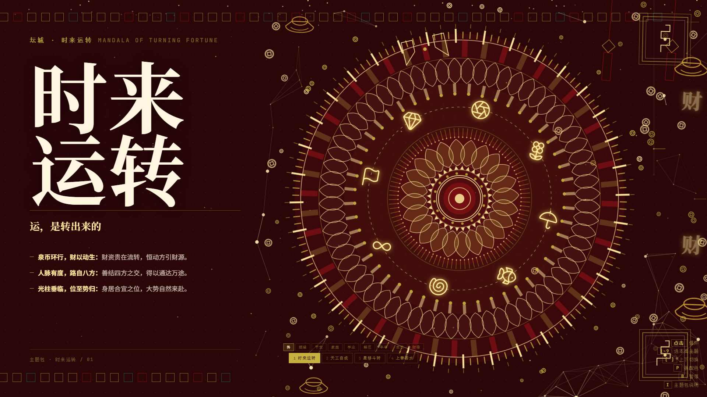

# 时来运转 · Mandala of Turning Fortune

An animated desktop wallpaper: **34 themes** of counter-rotating mandala geometry,
seamless 60-second loop, built as a plain HTML file. No plugin, no runtime — just one page.

> **▶ [Try it live](https://whhmmm.github.io/mandala-wallpaper/)** — runs in your browser, nothing to install.
>
> **⬇ [Download](https://github.com/whhmmm/mandala-wallpaper/releases/latest)** — Lively pack, or 1080p video.

A Tibetan mandala rebuilt as moving geometry. Nine concentric layers rotate at different
speeds — slow on the outside, faster toward the centre — so the whole thing reads as a
machine running rather than a picture that happens to move.

---

## Highlights

- **34 themes across 8 categories** — fortune, love, family, study, deliverance, harvest, growth, wealth
- **Seamless 60s loop** — every animation period is snapped to a whole fraction of 60s,
  so `t=0` and `t=60s` are the same frame. Verified: mean pixel difference 0.0015/255.
- **Counter-rotating layers** — 7–8 concentric rings, alternating direction, accelerating inward
- **Interactive** — click for a ripple burst, `P` recolours, `B` pauses, `I` opens the structure panel
- **Single file** — the whole wallpaper is one `index.html`, no build step

## Themes

| Category | Themes |
|---|---|
| 运势 Fortune | 时来运转 |
| 匠心 Craft | 天工自成 |
| 天时 Time | 星移斗转 |
| 自然 Nature | 上善若水 |
| 姻缘 Love | 花好月圆 · 琴瑟和鸣 · 喜结良缘 · 白头偕老 |
| 平安 Peace | 岁岁平安 · 四季平安 · 福寿康宁 |
| 家庭 Family | 五福临门 · 阖家团圆 · 人丁兴旺 · 世代同堂 |
| 学业 Study | 金榜题名 · 鱼跃龙门 · 蟾宫折桂 · 马到成功 |
| 解厄 Deliverance | 否极泰来 · 逢凶化吉 · 柳暗花明 · 云开见月 |
| 丰年 Harvest | 五谷丰登 · 风调雨顺 · 万象更新 · 新春大吉 |
| 生长 Growth | 生生不息 · 向阳而生 · 破茧成蝶 |
| 财禄 Wealth | 金玉满堂 · 日进斗金 · 鸿运当头 · 福星高照 |

## Install

### Lively Wallpaper (free, recommended)

1. Install [Lively Wallpaper](https://apps.microsoft.com/detail/9ntm2qc6qws7) (free)
2. Drag `mandala-turning-fortune.lively.zip` onto the Lively window

That's it — the pack is self-contained.

### Wallpaper Engine

1. Drop the `.mp4` into Wallpaper Engine, **or**
2. Point a *Web* wallpaper at `index.html`

### Just the video

`desktop-1920x1080-loop60.mp4` (H.264) and a `.webm` variant are attached to the
[latest release](../../releases/latest). Both are 60-second seamless loops.

## Options

Append URL parameters to `index.html`:

| Parameter | Meaning |
|---|---|
| `?theme=<id>` | Start on a specific theme, e.g. `?theme=five` |
| `?loop=60` | Align every animation to a seamless N-second loop |
| `?wall=1` | Wallpaper mode — centre the artwork, hide text and UI |

Example: `index.html?loop=60&wall=1&theme=mandala`

## Keyboard

| Key | Action |
|---|---|
| `1`–`9` | Pick a theme in the current category |
| `[` `]` | Previous / next theme |
| `P` | Cycle colour treatments |
| `B` | Pause everything |
| `H` | Hide text and UI |
| `I` | Show the theme structure panel |

## Notes

- Fonts and the icon set load from a CDN. Offline, the icons fall back to simple
  built-in shapes — the animation itself is unaffected.
- Roughly 850 SVG elements are live in the heaviest theme. On a low-end machine,
  press `B` to pause or pick a lighter theme.

## License

MIT — see [LICENSE](LICENSE). Use it, modify it, ship it.

---

## 中文说明

一套以藏传坛城为原型的动态壁纸，**34 个主题、8 个分类**，纯 HTML 单文件。

九层同心结构以不同速度反向旋转，由外向内逐层加快——外层慢到几乎静止，越靠内越快，
所以整幅画面读起来像一台正在运转的机器，而不是一张碰巧会动的图。

**无缝循环**：所有动画周期都被吸附到 60 秒的整数分之一，`t=0` 与 `t=60s` 是同一帧。
实测首尾帧平均像素差 0.0015/255。

**安装**：装免费的 Lively Wallpaper，把 `mandala-turning-fortune.lively.zip`
拖进窗口即可。或者直接把 mp4 拖进 Wallpaper Engine。

**操作**：`1`–`9` 换主题，`[` `]` 上下切换，`P` 换配色，`B` 暂停，`H` 隐藏文字，`I` 看结构说明。

**参数**：在网址后加 `?theme=five` 指定主题，`?loop=60` 开启无缝循环，
`?wall=1` 进入壁纸模式（主体居中、隐藏文字与界面）。
